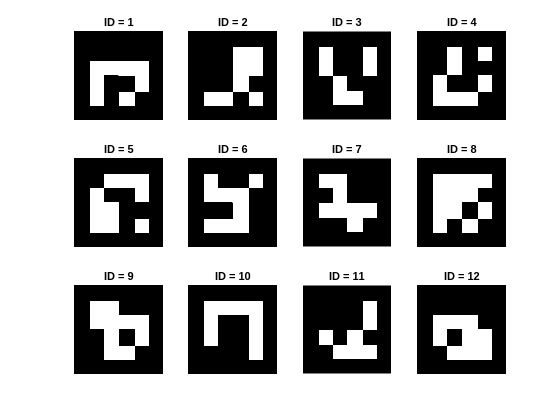
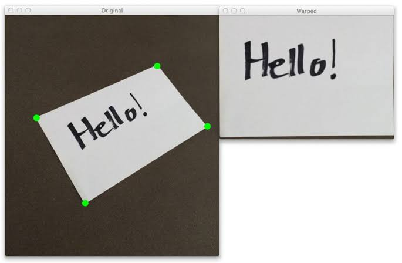
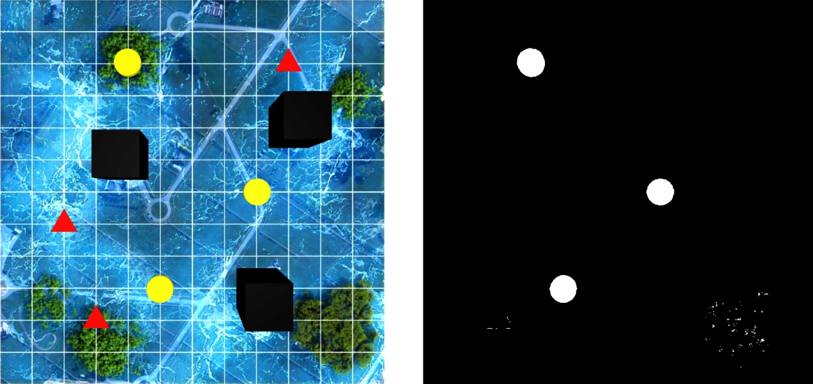

# E Yantra

## OpenCV

### Loading & Showing Image

```python
import cv2
image = cv2.imread("image.jpg")

# Convert BGR to RGB
rgb_image = cv2.cvtColor(image, cv2.COLOR_BGR2RGB)

# Display the RGB image
cv2.imshow("RGB Image", rgb_image)
cv2.waitKey(0)          # Wait indefinitely for a key press
cv2.destroyAllWindows() # Close all OpenCV windows
```

OpenCV images are just NumPy arrays with shape (height, width, channels). Each pixel is stored as `image[i][j] = [B, G, R]` because OpenCV loads color images in BGR format by default. If the image needs to be in the standard RGB format, we first convert it from BGR to RGB.

### Converting Image into Gray Scale

```python
gray = cv2.cvtColor(image, cv2.COLOR_BGR2GRAY)
```

Before applying many OpenCV operations like kernels, edge detection, thresholding, or contour detection, we usually convert the image to grayscale. Most of these techniques work by detecting changes in pixel intensity rather than color. Since a grayscale image has only one intensity channel, the algorithms become simpler, faster, and more reliable. That's why many classical OpenCV image processing functions are designed to work on grayscale images.

### ArUco Markers



When we capture an image with a camera, it is often taken at an angle. Because of perspective, a perfect square in the real world can appear stretched, tilted, or trapezoidal in the image.

For applications like QR scanners or CamScanner, we need a flat, top-down view of the document or object. To create this, we first detect the four corner points and then apply a perspective transformation that warps the image into a perfect rectangle.

The challenge is accurately finding those corners and understanding the orientation of the image. This is where ArUco markers are useful. They are specially designed square markers placed at the corners of an object or document. OpenCV can detect these markers, identify their orientation, and return their corner coordinates.

Once the markers are detected, we can use their corners to flatten the image, determine if it is rotated or upside down, and also estimate properties like pose, inclination, distance, and orientation relative to the camera.

```python
import cv2

image = cv2.imread("aruco_image.jpg")

# ArUco dictionary
aruco_dict = cv2.aruco.getPredefinedDictionary(cv2.aruco.DICT_4X4_250)

# Detector
detector = cv2.aruco.ArucoDetector(aruco_dict)

# Detect markers
corners, ids, rejected = detector.detectMarkers(image)

# Draw detected markers
output = cv2.aruco.drawDetectedMarkers(image.copy(), corners, ids)

cv2.imshow("ArUco Detection", output)
cv2.waitKey(0)
cv2.destroyAllWindows()
```

OpenCV provides several predefined ArUco dictionaries for different types of markers. For example, `DICT_4X4_250` contains 250 unique 4×4 ArUco markers. Each marker has a unique binary pattern and a unique ID (0–249).

We first load the dictionary we want, then use it to create an `ArucoDetector`. This detector is used to find markers in an image. Although it works with a color image, a grayscale image is recommended because ArUco detection only depends on pixel intensity, making it a little faster.

`detectMarkers()` returns three things:

- `corners` – the four corner coordinates of every detected marker, stored as four `(x, y)` points.
- `ids` – the unique ID of each detected marker.
- `rejected` – regions that looked like ArUco markers at first but were rejected after verification. If your marker is not being detected, this is a useful place to check.

Finally, `drawDetectedMarkers()` takes the original image along with the detected `corners` and `ids`, and returns a new image with a box drawn around every marker and its ID displayed on top.

### Perspective transform



Perspective transform in OpenCV is used to change the viewpoint of an image. It maps four points in the original image to four points in a new image, allowing us to warp a tilted or angled object into a flat view.

```python
image = cv2.imread("document.jpg")

# Four corner points in the original image (x, y)
src_points = np.float32([
    [120, 80],    # Top-left
    [520, 60],    # Top-right
    [560, 420],   # Bottom-right
    [100, 450]    # Bottom-left
])

# Desired corner points in the output image
width, height = 400, 500
dst_points = np.float32([
    [0, 0],
    [width, 0],
    [width, height],
    [0, height]
])

# Compute perspective transformation matrix
matrix = cv2.getPerspectiveTransform(src_points, dst_points)

# Warp the image
warped = cv2.warpPerspective(image, matrix, (width, height))

cv2.imshow("Original", image)
cv2.imshow("Warped", warped)
```

`cv2.warpPerspective()` applies a perspective transformation to an image using the 3×3 transformation matrix. The `(width, height)` argument specifies the size of the output image. OpenCV creates a new image of these dimensions and fills it by mapping pixels from the original image using the perspective transform.

### Object Detection

We don't always need an AI model for object detection. If the objects are simple shapes with distinct colors, we can detect them using basic image processing techniques in OpenCV.

**High Level Overview**

- Create a color mask that converts the desired colored objects into white and everything else into black.
- Remove noise from the mask using morphological operations. This removes small unwanted blobs and fills tiny holes inside the detected shapes.
- Find contours of the cleaned shapes and use image moments to compute the centroid (center) of each shape.

**Creating Mask**



```python
import cv2
import numpy as np

img = cv2.imread("test_img.jpg")

hsv = cv2.cvtColor(img, cv2.COLOR_BGR2HSV)
yellow_lower = np.array([20, 100, 100])
yellow_upper = np.array([40, 255, 255])

mask = cv2.inRange(hsv, yellow_lower, yellow_upper)

cv2.imshow("Original Image",img)
cv2.imshow("Yellow Mask", mask)
```

- We use HSV because it separates color from brightness, making color detection much more reliable.

- Hue: `20–40` → Yellow Range
- Saturation: `100–255` → Ignore very dull or grayish yellows
- Value: `100–255` → Ignore very dark yellow pixels (almost black)


**Removing Noise**

We remove noise using two basic morphological operations: erosion and dilation.

- Erosion: Removes small white noise by shrinking white regions. Tiny isolated white dots disappear because they are too small to survive the erosion.
- Dilation: Expands the remaining white regions, restoring the size of the main shapes after erosion.

To remove small white noise while preserving larger objects, OpenCV uses Opening, which is erosion followed by dilation.

```python
kernel = cv2.getStructuringElement(cv2.MORPH_ELLIPSE, (5, 5))
cleaned = cv2.morphologyEx(image, cv2.MORPH_OPEN, kernel)
```

> The input image should be binary, meaning every pixel is either 0 (black) or 255 (white) with no intermediate grayscale values.
> 

> We use an elliptical kernel because its rounded shape preserves curved or circular boundaries better than a rectangular kernel during erosion and dilation, reducing corner distortion in the main objects.
> 


**Finding Centroids**

```python
contours, _ = cv2.findContours(cleaned, cv2.RETR_EXTERNAL,cv2.CHAIN_APPROX_SIMPLE)
centroids = []
	
for cnt in contours:
		if cv2.contourArea(cnt) < MIN_CONTOUR_AREA:
		    continue
    M = cv2.moments(cnt)
    if M["m00"] == 0:
        continue

    cx = M["m10"] / M["m00"]
    cy = M["m01"] / M["m00"]

    centroids.append((cx, cy))
```

Contours are the boundary (outline) of a shape in a binary image.

With `cv2.findContours()`, we can control which contours are returned and how the contour points are stored.

- `cv2.RETR_EXTERNAL` returns only the outermost contours of each shape, ignoring inner contours or holes.
- `cv2.CHAIN_APPROX_SIMPLE` stores only the essential boundary points instead of every pixel along the contour. For example, for a rectangle, storing every pixel on each edge is unnecessary; storing the corner points is enough because the intermediate points can be reconstructed when needed. This reduces memory usage.

`findContours()` returns a list of contour objects, where each contour is a NumPy array containing the boundary points of one shape.

These contour objects can be passed directly to OpenCV contour functions such as:

- `cv2.contourArea(cnt)` — returns the area enclosed by the contour.
- `cv2.moments(cnt)` — returns the geometric moments of the contour, including:
    - `m00` → area,
    - `m10` → x-weighted moment,
    - `m01` → y-weighted moment.